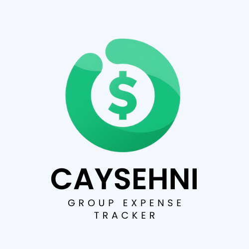

<a id="readme-top"></a>

<!-- PROJECT SHIELDS -->
[![Contributors][contributors-shield]][contributors-url]
[![Forks][forks-shield]][forks-url]
[![Stargazers][stars-shield]][stars-url]
[![Issues][issues-shield]][issues-url]
[![License][license-shield]][license-url]

<!-- PROJECT LOGO -->
<br />
<div align="center">
  

  <h3 align="center">Cayeshni</h3>

  <p align="center">
    A full‑stack expense splitting and group settlement platform.
    <br />
    <a href="docs/README.md"><strong>📚 Explore the Docs »</strong></a>
    <br />
    <br />
    <a href="#demo">🎬 Demo Video</a>
    &nbsp;·&nbsp;
    <a href="https://github.com/SWE-Project-Final-Team/Cayeshni/issues/new?template=bug.yml">🐛 Report Bug</a>
    &nbsp;·&nbsp;
    <a href="https://github.com/SWE-Project-Final-Team/Cayeshni/issues/new?template=feature.yml">✨ Request Feature</a>
  </p>
</div>

---

<!-- TABLE OF CONTENTS -->
<details>
  <summary>📑 Table of Contents</summary>
  <ol>
    <li><a href="#about-the-project">About The Project</a></li>
    <li><a href="#tech-stack">Tech Stack</a></li>
    <li><a href="#getting-started">Getting Started</a></li>
    <li><a href="#demo">Demo</a></li>
    <li><a href="#features">Features</a></li>
    <li><a href="#roadmap">Roadmap</a></li>
    <li><a href="#contributing">Contributing</a></li>
    <li><a href="#license">License</a></li>
  </ol>
</details>

---

<!-- ABOUT THE PROJECT -->
<a id="about-the-project"></a>
## 📋 About The Project

Cayeshni is a secure full-stack platform for splitting expenses, managing group balances, and settling shared payments.

**Core capabilities:**
- Authentication and identity management
- Group creation and invite-based membership
- Transactions, balances, and settlements
- Friend management and notifications
- File uploads with validation

---

<a id="tech-stack"></a>
## 🛠️ Tech Stack

**Backend**

[![aspnet][aspnet-badge]][aspnet-url]
[![postgres][postgres-badge]][postgres-url]
[![jwt][jwt-badge]][jwt-url]
[![xunit][xunit-badge]][xunit-url]

**Frontend**

[![nextjs][nextjs-badge]][nextjs-url]
[![typescript][typescript-badge]][typescript-url]
[![tailwind][tailwind-badge]][tailwind-url]

**DevOps & Infrastructure**

[![docker][docker-badge]][docker-url]
[![ghactions][ghactions-badge]][ghactions-url]

---

<!-- GETTING STARTED -->
<a id="getting-started"></a>
## 🚀 Getting Started

### Prerequisites

- .NET SDK (net10.0)
- Node.js 20+
- Docker Desktop (recommended)
- PostgreSQL (if running backend without Docker)

### Installation

**1. Environment configuration**

Create a `.env` file at the repository root. Copy [`.env.example`](.env.example) and update secrets and connection settings.

**2. Run with Docker (recommended)**

```bash
docker compose up --build
```

The stack exposes:
| Service    | URL                         |
|------------|-----------------------------|
| API        | http://localhost:8080        |
| Web        | http://localhost:3000        |
| PostgreSQL | localhost:5432               |

**3. Run locally (without Docker)**

Backend:
```bash
cd backend
dotnet restore
dotnet run --project Cayeshni.API
```

Frontend:
```bash
cd frontend
npm install
npm run dev
```

### Database Migrations

Helper scripts are available in the `backend/` folder:

```bash
# PowerShell
./create-migration.ps1

# Bash
./create-migration.sh
```

### API Documentation

When running in Development mode, the API exposes:

| Interface   | URL                                        |
|-------------|--------------------------------------------|
| OpenAPI JSON | http://localhost:8080/openapi/v1.json     |
| Scalar UI   | http://localhost:8080/scalar/v1            |
| Swagger UI  | http://localhost:8080/swagger              |

---

<!-- DEMO -->
<a id="demo"></a>
## 🎬 Demo

> Demo video coming soon.

### Screenshots

> Screenshots coming soon.

---

<!-- FEATURES -->
<a id="features"></a>
## ✨ Features

Detailed documentation for each feature lives in [`docs/features/`](docs/features/README.md):

| Feature | Description |
|---|---|
| 🔐 Authentication & Identity | Secure login, registration, and token management |
| 👤 User Management | Profile management and settings |
| 👥 Groups | Create groups, invite members, manage membership |
| 🤝 Friends | Send and manage friend connections |
| 💸 Transactions | Add, split, and track shared expenses |
| 🏦 Settlements | Calculate and settle balances between members |
| 📊 Dashboard | Overview of balances, activity, and summaries |

---

<!-- ROADMAP -->
<a id="roadmap"></a>
## 🗺️ Roadmap

- [x] Core authentication and identity management
- [x] Group and transaction management
- [x] Settlement calculations and automation
- [ ] Mobile app support
- [ ] Real-time notifications
- [ ] Advanced analytics and reporting
- [ ] Multi-currency support

See the [open issues](https://github.com/SWE-Project-Final-Team/Cayeshni/issues) for a full list of planned features and known bugs.

---

<!-- CONTRIBUTING -->
<a id="contributing"></a>
## 🤝 Contributing

Contributions, issues, and feature requests are welcome!

Check the [issues page](https://github.com/SWE-Project-Final-Team/Cayeshni/issues) to get started, or read the full [contributing guide](docs/CONTRIBUTING.md).

### Contributors

<a href="https://github.com/SWE-Project-Final-Team/Cayeshni/graphs/contributors">
  
</a>

---

## ⭐ Show Your Support

If this project helped you, please give it a star! It helps us reach more people.

---

<!-- LICENSE -->
<a id="license"></a>
## 📄 License

This project is still under active development. License terms have not been finalized yet.

<p align="right"><a href="#readme-top">↑ Back to top</a></p>

---

<!-- MARKDOWN LINKS & IMAGES -->
[contributors-shield]: https://img.shields.io/github/contributors/SWE-Project-Final-Team/Cayeshni.svg?style=for-the-badge
[contributors-url]: https://github.com/SWE-Project-Final-Team/Cayeshni/graphs/contributors
[forks-shield]: https://img.shields.io/github/forks/SWE-Project-Final-Team/Cayeshni.svg?style=for-the-badge
[forks-url]: https://github.com/SWE-Project-Final-Team/Cayeshni/network/members
[stars-shield]: https://img.shields.io/github/stars/SWE-Project-Final-Team/Cayeshni.svg?style=for-the-badge
[stars-url]: https://github.com/SWE-Project-Final-Team/Cayeshni/stargazers
[issues-shield]: https://img.shields.io/github/issues/SWE-Project-Final-Team/Cayeshni.svg?style=for-the-badge
[issues-url]: https://github.com/SWE-Project-Final-Team/Cayeshni/issues
[license-shield]: https://img.shields.io/github/license/SWE-Project-Final-Team/Cayeshni.svg?style=for-the-badge
[license-url]: https://github.com/SWE-Project-Final-Team/Cayeshni/blob/main/LICENSE

<!-- TECH STACK BADGES -->
[aspnet-badge]: https://img.shields.io/badge/ASP.NET%20Core-512BD4?style=for-the-badge&logo=dotnet&logoColor=white
[aspnet-url]: https://dotnet.microsoft.com/apps/aspnet
[postgres-badge]: https://img.shields.io/badge/PostgreSQL-336791?style=for-the-badge&logo=postgresql&logoColor=white
[postgres-url]: https://www.postgresql.org/
[jwt-badge]: https://img.shields.io/badge/JWT-000000?style=for-the-badge&logo=jsonwebtokens&logoColor=white
[jwt-url]: https://jwt.io/
[xunit-badge]: https://img.shields.io/badge/xUnit-512BD4?style=for-the-badge&logo=dotnet&logoColor=white
[xunit-url]: https://xunit.net/
[nextjs-badge]: https://img.shields.io/badge/Next.js-000000?style=for-the-badge&logo=nextdotjs&logoColor=white
[nextjs-url]: https://nextjs.org/
[typescript-badge]: https://img.shields.io/badge/TypeScript-3178C6?style=for-the-badge&logo=typescript&logoColor=white
[typescript-url]: https://www.typescriptlang.org/
[tailwind-badge]: https://img.shields.io/badge/Tailwind%20CSS-06B6D4?style=for-the-badge&logo=tailwindcss&logoColor=white
[tailwind-url]: https://tailwindcss.com/
[docker-badge]: https://img.shields.io/badge/Docker-2496ED?style=for-the-badge&logo=docker&logoColor=white
[docker-url]: https://www.docker.com/
[ghactions-badge]: https://img.shields.io/badge/GitHub%20Actions-2088FF?style=for-the-badge&logo=githubactions&logoColor=white
[ghactions-url]: https://github.com/features/actions