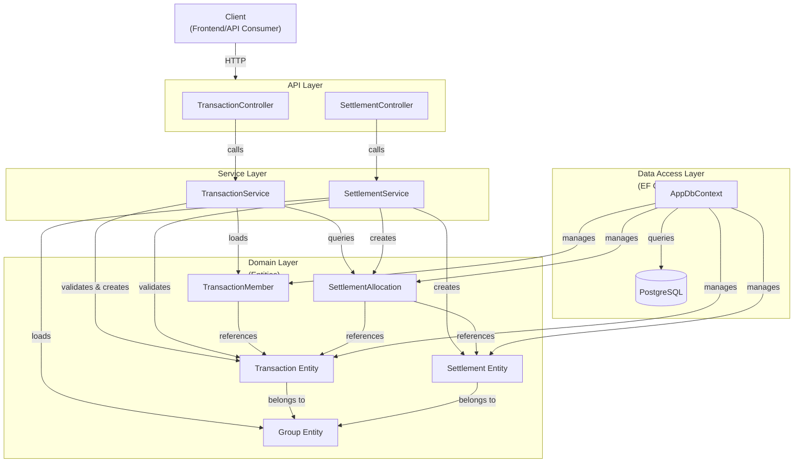
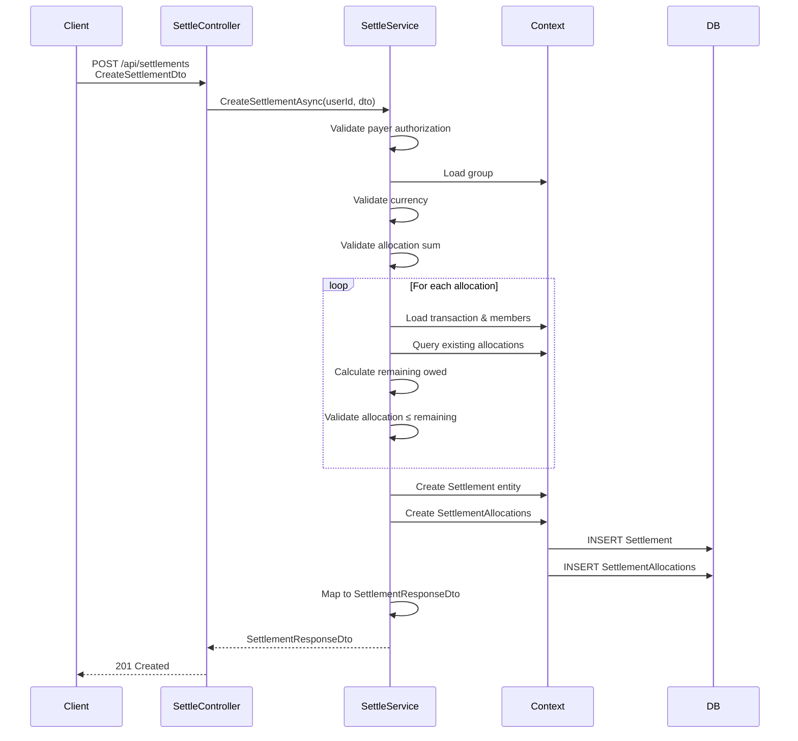
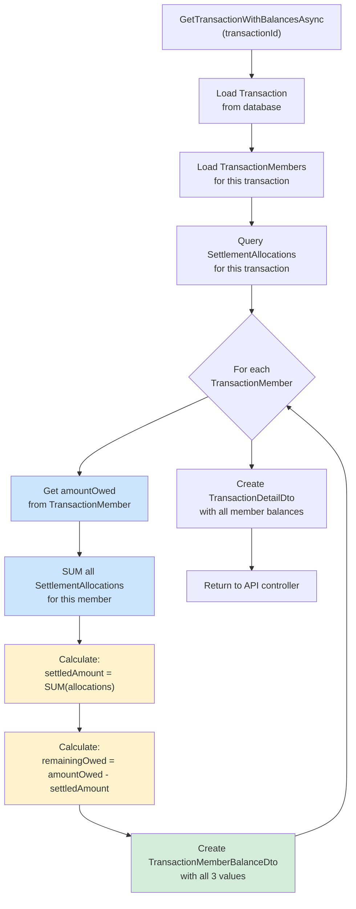
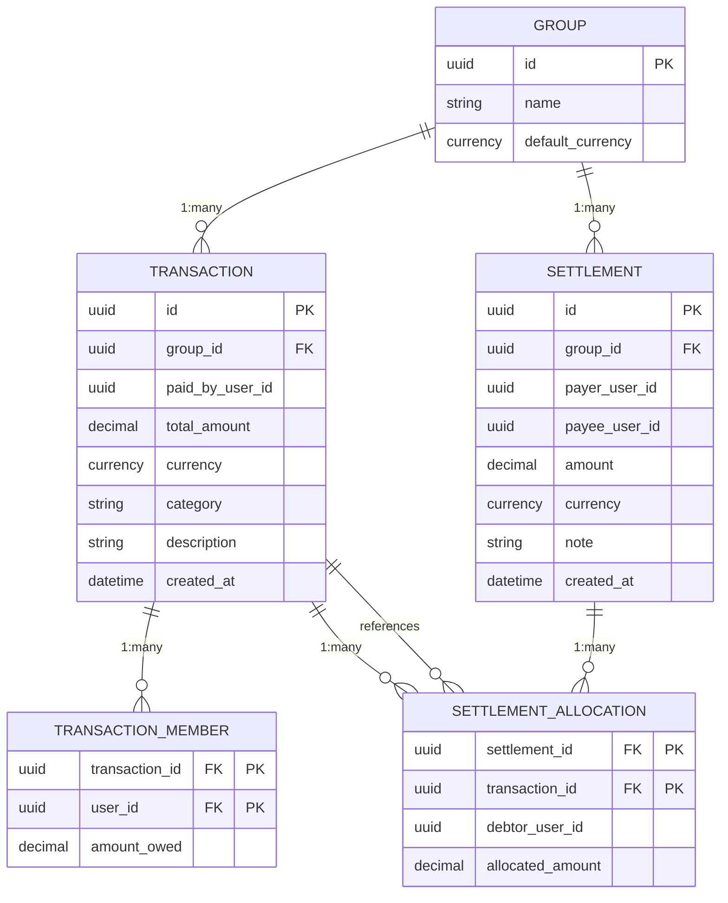
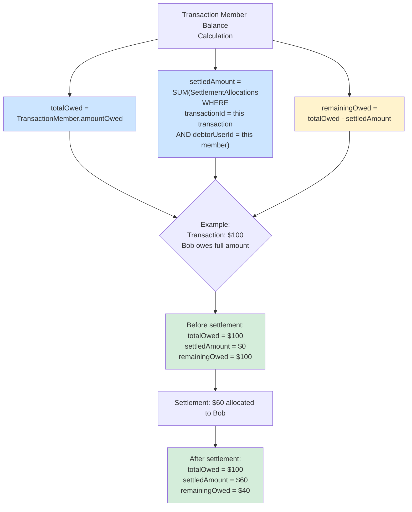
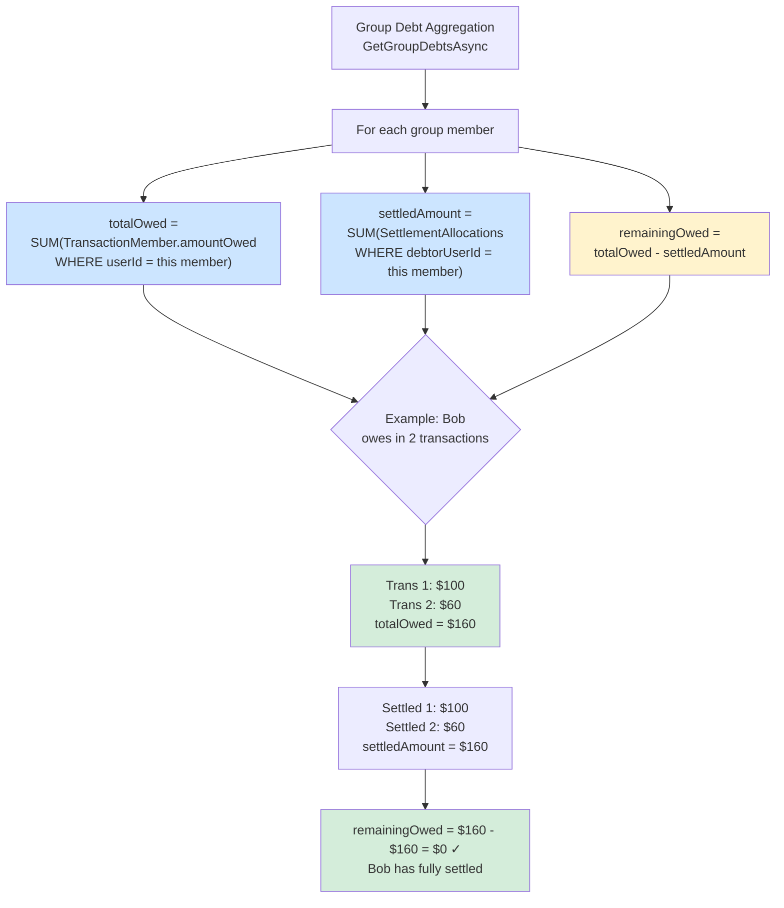

# Transactions & Settlements Architecture

## System Architecture

## Data Flow: Creating Settlement

## Data Flow: Calculating Transaction Balance

## Relationship Diagram

## Balance Calculation Formula

## Group Debt Aggregation Formula

