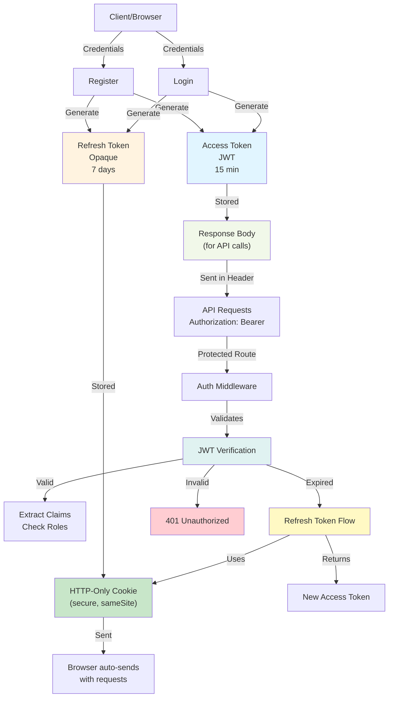
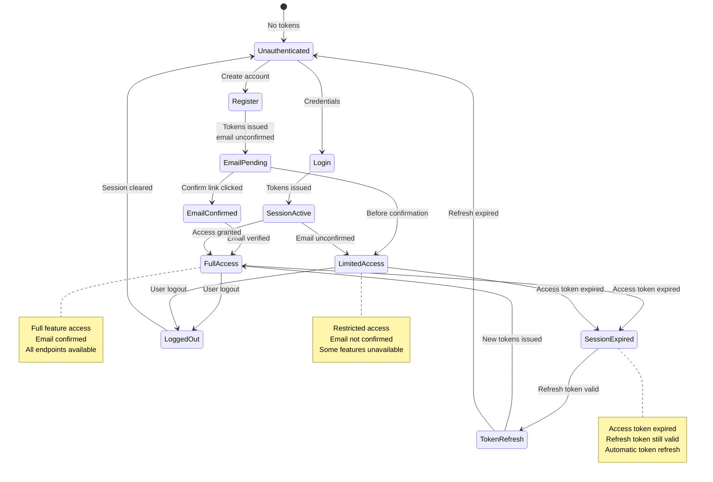

# Authentication Architecture

## Token & Session Architecture



## Authentication Flow States



## Service Layer Architecture

```
AuthService
├── RegisterAsync(dto)
│   ├── Validate name (trimmed, ≥3 chars)
│   ├── Validate email format (RFC pattern)
│   └── Delegate to IIdentityService.RegisterAsync
│
├── LoginAsync(dto)
│   └── Delegate to IIdentityService.LoginAsync
│       ├── Query user by email
│       ├── Verify password hash
│       ├── Generate JWT access token
│       ├── Generate refresh token
│       └── Return token pair
│
├── RefreshTokenAsync(refreshToken)
│   └── Delegate to IIdentityService.RefreshTokenAsync
│       ├── Validate refresh token exists
│       ├── Verify token hash
│       ├── Generate new access token
│       ├── Generate new refresh token
│       └── Return new token pair
│
├── LogoutAsync()
│   └── Invalidate current session
│       └── Clear refresh token
│
├── ChangePasswordAsync(userId, dto)
│   ├── Verify current password
│   ├── Validate new password strength
│   ├── Hash new password
│   ├── Update user record
│   └── Invalidate all refresh tokens
│
├── ForgotPasswordAsync(email)
│   ├── Query user (if exists)
│   ├── Generate reset token
│   ├── Send reset email (async)
│   └── Return generic success
│
├── ResetPasswordAsync(dto)
│   ├── Validate reset token
│   ├── Hash new password
│   ├── Update password
│   └── Invalidate refresh tokens
│
├── ConfirmEmailAsync(dto)
│   ├── Validate confirmation token
│   ├── Update EmailConfirmed flag
│   └── Delete token record
│
└── ResendConfirmationAsync(email)
    ├── Query user (if exists)
    ├── Generate new token
    ├── Send email (async)
    └── Return generic success
```

## Database Schema

### AppUser Table (ASP.NET Identity)
```
Id                      (GUID, PK)
Email                   (string)
NormalizedEmail         (string)        - Uppercase for lookups
PasswordHash            (string)        - Bcrypt/PBKDF2
EmailConfirmed          (bool)          - true when verified
Name                    (string)
ProfilePicturePath      (string?)
PreferredCurrency       (enum)
CreatedAt               (DateTime)
```

**Indexes:**
- NormalizedEmail (unique)

### RefreshToken Table
```
UserId                  (GUID, FK AppUser)
TokenHash               (string, PK)    - Hash of token
ExpiresAt               (DateTime)
CreatedAt               (DateTime)
RevokedAt               (DateTime?)     - null if active
```

**Indexes:**
- UserId (multiple tokens per user)
- ExpiresAt (cleanup queries)

### EmailConfirmationToken Table
```
UserId                  (GUID, FK AppUser)
Token                   (string, PK)    - Time-limited token
ExpiresAt               (DateTime)
CreatedAt               (DateTime)
```

**Indexes:**
- UserId
- ExpiresAt (cleanup)

### PasswordResetToken Table
```
UserId                  (GUID, FK AppUser)
Token                   (string, PK)    - Time-limited token
ExpiresAt               (DateTime)
CreatedAt               (DateTime)
```

**Indexes:**
- UserId
- ExpiresAt (cleanup)

## JWT Access Token Structure

```
Header: {
  "alg": "HS256",
  "typ": "JWT"
}

Payload: {
  "sub": "userId",                    // Subject (user ID)
  "email": "user@example.com",
  "name": "User Name",
  "preferred_currency": "USD",
  "email_verified": true,
  "iat": 1234567890,                  // Issued at
  "exp": 1234569690,                  // Expires (15 min)
  "iss": "Cayeshni"                   // Issuer
}

Signature: HMACSHA256(header + payload, secret_key)
```

## Security Measures

### Password Security
- **Hashing**: PBKDF2 with salt (ASP.NET Identity default)
- **Comparison**: Timing-safe comparison (prevents timing attacks)
- **Strength**: ASP.NET Identity enforces complexity rules
- **Breach**: No plain text storage, only hashes

### Token Security
- **JWT Secret**: Strong key stored in configuration
- **Expiration**: Access token 15 minutes, refresh 7 days
- **HttpOnly Cookie**: Refresh token immune to XSS
- **Secure Flag**: HTTPS only transmission
- **SameSite**: CSRF protection (Strict policy)
- **Refresh Invalidation**: All tokens cleared on password change

### Rate Limiting
- **Forgot Password**: Limited per IP/email (prevent enumeration)
- **Resend Confirmation**: Limited per email (prevent spam)
- **Login**: Optional rate limiting on repeated failures

### Email Verification
- **Confirmation Required**: Prevents fake emails
- **Token Expiration**: Link valid for 24 hours
- **Prevent Enumeration**: Generic responses on forgot/resend
- **Async Send**: Non-blocking to prevent service delays

### Session Management
- **Refresh Token Storage**: Hash stored, not raw token
- **Revocation**: All sessions cleared on password change
- **Expiration**: Automatic cleanup of expired tokens
- **Multi-device**: Multiple refresh tokens per user

## Error Handling

| Error | Scenario | HTTP Status | Message |
|-------|----------|------------|---------|
| ValidationException | Invalid email format | 400 | "Please enter a valid email address." |
| ValidationException | Name < 3 characters | 400 | "Name must be at least 3 characters." |
| ValidationException | Email already registered | 400 | Generic validation error |
| UnauthorizedException | Invalid credentials | 401 | "Invalid email or password." |
| UnauthorizedException | Missing refresh token | 401 | "Refresh token is missing." |
| NotFoundException | User not found (change password) | 404 | Not found |
| ValidationException | Invalid/expired reset token | 400 | "Invalid or expired reset link." |
| ValidationException | Password mismatch (change) | 400 | "Current password is incorrect." |

## Performance Considerations

### Optimizations
- JWT tokens are stateless (no database lookup on each request)
- Refresh tokens cached in memory if possible
- Email sending happens async (doesn't block response)
- Token cleanup runs as background job
- Normalized email index prevents N queries on login

### Scalability
- No session state on server (stateless JWT)
- Refresh tokens distributed across servers via database
- Email sending offloaded to queue/service
- Rate limiting can use distributed cache (Redis)

## Configuration Parameters

```csharp
// Token Expiration
AccessTokenExpirationMinutes = 15
RefreshTokenExpirationDays = 7
EmailConfirmationTokenExpirationHours = 24
PasswordResetTokenExpirationHours = 24

// Validation
MinimumPasswordLength = 6
PasswordRequireUppercase = false
PasswordRequireNumbers = false

// Security
JwtSecret = "long-random-string-from-config"
EmailConfirmationRequired = true
RequireRefreshTokenRotation = true

// Rate Limiting
ForgotPasswordLimitPerHour = 3
ResendConfirmationLimitPerHour = 5
LoginAttemptsBeforeLockout = 5
LockoutDurationMinutes = 15
```

## Integration Points

### External Dependencies
- **Email Service**: For confirmation, reset, and notification emails
- **JWT Library**: System.IdentityModel.Tokens.Jwt for token generation
- **Hash Library**: PBKDF2 via ASP.NET Identity
- **Rate Limiting**: Middleware for endpoint protection

### Related Services
- **UserService**: Loads user profile after authentication
- **GroupService**: Permission checks for group operations
- **TransactionService**: Permission checks for transaction operations
- **FriendService**: Requires authentication for friendship operations
