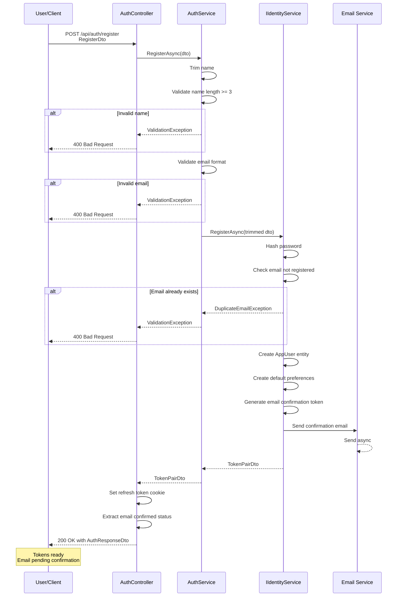
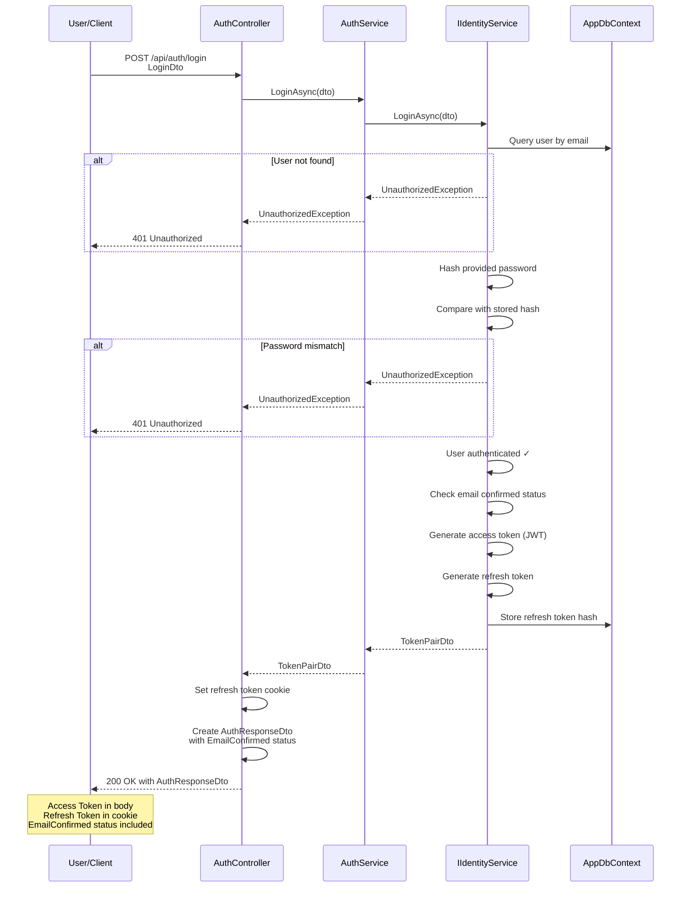
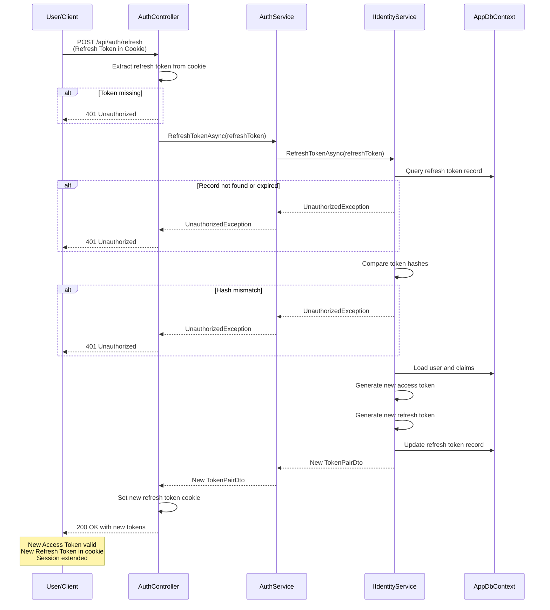
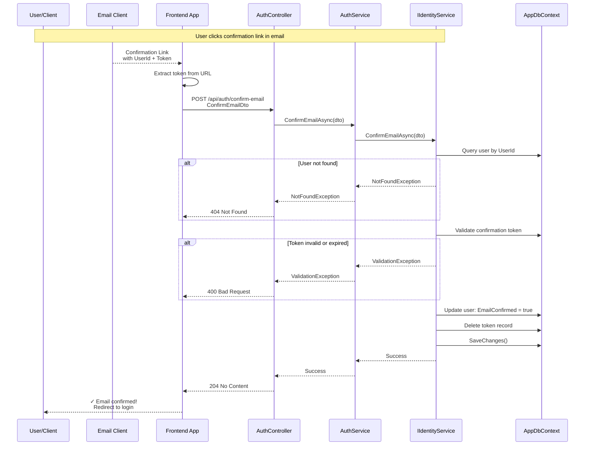
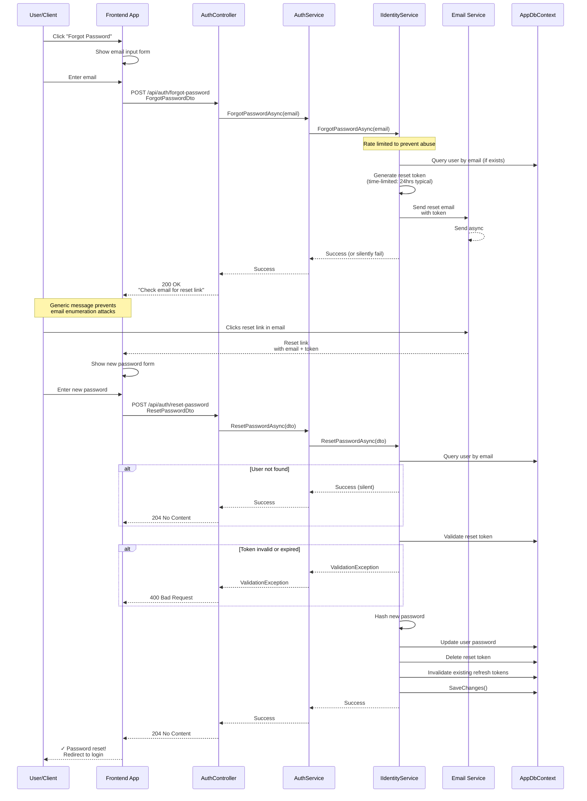
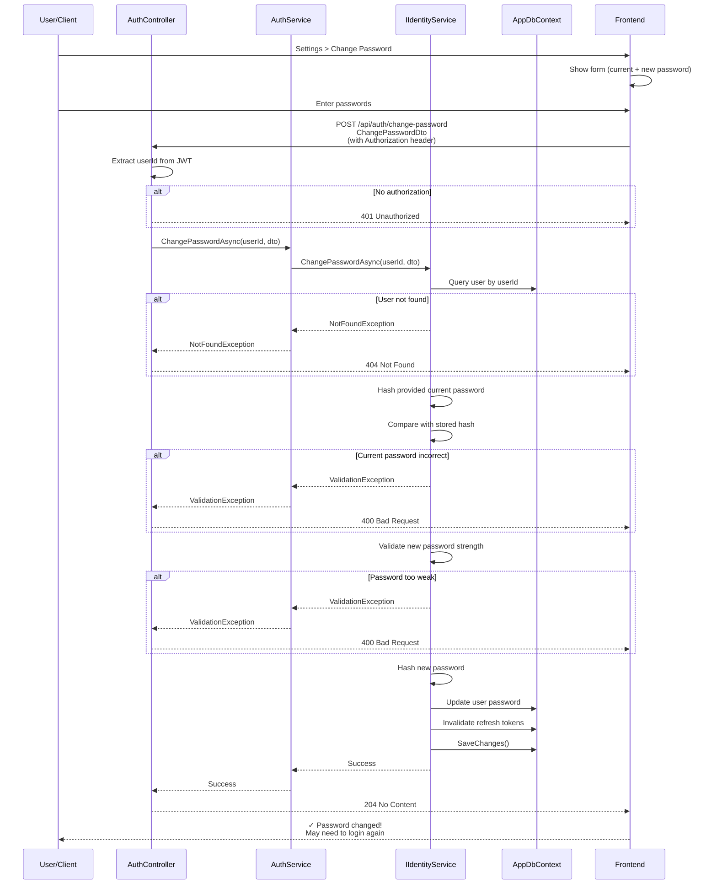

# Authentication Sequence Diagrams

## Register Flow

### Process Steps
1. User submits registration details
2. Service validates name (trimmed, ≥3 characters)
3. Service validates email format (RFC-like)
4. Identity service checks email uniqueness
5. Password is hashed using secure algorithm
6. AppUser and preferences created in database
7. Email confirmation token generated
8. Confirmation email sent (async)
9. Refresh token set in httpOnly cookie
10. Access token returned in response body

---

## Login Flow

### Process Steps
1. User submits email and password
2. Service queries database for user
3. If not found: return 401 Unauthorized
4. Password hash compared (timing-safe)
5. If mismatch: return 401 Unauthorized
6. Email confirmation status checked
7. JWT access token generated (expires: 15min typical)
8. Refresh token generated (expires: 7 days typical)
9. Refresh token hash stored in database
10. Refresh token set in httpOnly cookie (secure, sameSite)
11. Access token returned in response
12. EmailConfirmed flag indicates full vs. limited access

---

## Refresh Token Flow

### Process Steps
1. Client sends refresh request with token in httpOnly cookie
2. Controller extracts refresh token from secure cookie
3. Service validates token exists and not expired
4. Token hash verified against database record
5. User and claims loaded
6. New access token generated
7. New refresh token generated
8. Old refresh token replaced in database
9. New refresh token set in cookie
10. New access token returned in response
11. Session effectively extended for another interval

---

## Email Confirmation Flow

### Process Steps
1. User receives email with confirmation link
2. Link contains: userId and confirmation token
3. User clicks link (from email or copy-paste)
4. Frontend extracts parameters from URL
5. Frontend calls confirmation endpoint
6. Service validates token against database
7. Token checked for expiration
8. User's EmailConfirmed flag updated
9. Confirmation token record deleted
10. Success response sent
11. Frontend redirects to login or dashboard

---

## Forgot Password & Reset Flow

### Process Steps
1. User initiates forgot password from frontend
2. User submits email address
3. Service rate-limits to prevent abuse
4. Database queried for user (but response is always generic)
5. If user exists: generate time-limited reset token
6. Send email with reset link containing token
7. Generic success response (prevents email enumeration)
8. User receives email and clicks reset link
9. Frontend shows password reset form
10. User enters new password
11. Service validates reset token
12. If valid: hash new password
13. Update user record with new password
14. Invalidate all existing refresh tokens (force logout everywhere)
15. Delete reset token record
16. Success response sent to frontend

---

## Change Password Flow

### Process Steps
1. User navigates to password change form
2. User enters current and new password
3. Frontend sends request with Authorization header
4. Controller validates JWT and extracts userId
5. Service validates user exists
6. Current password verified via hash comparison
7. New password validated against strength requirements
8. New password hashed using secure algorithm
9. User record updated with new password
10. All existing refresh tokens invalidated (force logout everywhere)
11. Success response sent
12. User may need to re-authenticate to continue
