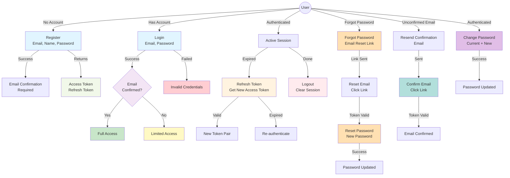

# Authentication Use Case Diagram

## Description

This diagram shows all user interactions with the authentication system:

### Account Management
- **Register**: Create new account with email, name, password, and preferred currency
  - Validates email format and name length (≥3 chars)
  - Returns access and refresh tokens
  - Requires email confirmation for full access

- **Login**: Authenticate with email and password
  - Returns tokens on success
  - Email confirmation status affects access level
  - Invalid credentials return error

- **Logout**: End authenticated session
  - Clears refresh token cookie
  - Invalidates session

### Session Management
- **Refresh Token**: Extend session with valid refresh token
  - Returns new token pair without re-entering credentials
  - Refresh token expiration requires re-authentication
  - Prevents excessive login prompts

### Password Management
- **Change Password**: Update password while authenticated
  - Requires current password verification
  - Sets new password immediately

- **Forgot Password**: Reset password via email link
  - Sends reset link to email address
  - Link contains time-limited token
  - User sets new password using token

### Email Verification
- **Confirm Email**: Verify email ownership via link
  - Enables full feature access
  - Link sent during registration
  - Users can resend if needed

- **Resend Confirmation**: Re-send email verification
  - Rate-limited to prevent abuse
  - Required before full access

### Error Handling
- Invalid email format
- Invalid credentials
- Expired tokens
- Rate limiting on sensitive operations
