# Cayeshni Class Diagram

This diagram shows the domain model and key entities in the Cayeshni application.

```mermaid
classDiagram

%% ─────────────────────────────────────────
%%  ENUMERATIONS
%% ─────────────────────────────────────────

class Currency {
    <<enumeration>>
    USD
    EUR
    GBP
    EGP
    AED
    SAR
    JPY
    CAD
    AUD
    CHF
    CNY
}

class TransactionCategory {
    <<enumeration>>
    Transport
    Food
    Accommodation
    Entertainment
    Utilities
    Shopping
    Other
}

class FriendshipStatus {
    <<enumeration>>
    Pending
    Friends
    Blocked
}

class NotificationType {
    <<enumeration>>
    FriendRequestReceived
    FriendRequestAccepted
    GroupInviteReceived
    GroupJoinApproved
    GroupJoinDeclined
    TransactionCreated
    TransactionUpdated
    PaymentReceived
}

class FileFolder {
    <<enumeration>>
    ProfilePictures
    Attachments
}

%% ─────────────────────────────────────────
%%  IDENTITY
%% ─────────────────────────────────────────

class IdentityUser {
    <<abstract>>
    +Id : string
    +Email : string
    +UserName : string
    +PasswordHash : string
    +EmailConfirmed : bool
}

class AppUser {
    +Id : string
    +Name : string
    +CreatedAt : DateTime
}

%% ─────────────────────────────────────────
%%  GROUP MANAGEMENT
%% ─────────────────────────────────────────

class Group {
    +Id : Guid
    +Name : string
    +DefaultCurrency : Currency
    +InviteToken : string
    +CreatedById : Guid
    +CreatedAt : DateTime
    +RowVersion : byte[]
}

class GroupMember {
    +GroupId : Guid
    +UserId : Guid
    +JoinedAt : DateTime
}

%% ─────────────────────────────────────────
%%  SOCIAL FEATURES
%% ─────────────────────────────────────────

class Friendship {
    +UserIdA : string
    +UserIdB : string
    +Status : FriendshipStatus
    +CreatedAt : DateTime
    +UpdatedAt : DateTime
}

class Notification {
    +Id : Guid
    +Type : NotificationType
    +RecipientId : string
    +SenderUserId : string
    +GroupId : Guid
    +TransactionId : Guid
    +SettlementId : Guid
    +Text : string
    +IsRead : bool
    +CreatedAt : DateTime
}

%% ─────────────────────────────────────────
%%  TRANSACTIONS & SETTLEMENTS
%% ─────────────────────────────────────────

class Transaction {
    +Id : Guid
    +GroupId : Guid
    +PaidByUserId : Guid
    +TotalAmount : decimal
    +Currency : Currency
    +Category : TransactionCategory
    +Description : string
    +CreatedAt : DateTime
    +RowVersion : byte[]
}

class TransactionMember {
    +TransactionId : Guid
    +UserId : Guid
    +AmountOwed : decimal
}

class Settlement {
    +Id : Guid
    +GroupId : Guid
    +PayerUserId : Guid
    +PayeeUserId : Guid
    +Amount : decimal
    +Currency : Currency
    +Note : string
    +CreatedAt : DateTime
}

class SettlementAllocation {
    +SettlementId : Guid
    +TransactionId : Guid
    +DebtorUserId : Guid
    +AllocatedAmount : decimal
}

%% ─────────────────────────────────────────
%%  RELATIONSHIPS
%% ─────────────────────────────────────────

Group "1" o-- "*" GroupMember : has
Group "1" o-- "*" Transaction : contains
Group "1" o-- "*" Settlement : tracks
Group "1" o-- "*" Notification : sends
Friendship : uses --> FriendshipStatus
Transaction : uses --> TransactionCategory
Transaction : uses --> Currency
Transaction : has --> TransactionMember
Settlement : uses --> Currency
SettlementAllocation : links --> Settlement
SettlementAllocation : links --> Transaction
Notification : uses --> NotificationType
AppUser : can have --> Friendship
AppUser : can have --> Transaction
AppUser : can have --> Settlement
IdentityUser <|-- AppUser : extends
```

## Entity Descriptions

### Enumerations
- **Currency**: Supported currencies (USD, EUR, GBP, EGP, AED, SAR, JPY, CAD, AUD, CHF, CNY)
- **TransactionCategory**: Categories for transactions (Transport, Food, Accommodation, etc.)
- **FriendshipStatus**: Social relationship states (Pending, Friends, Blocked)
- **NotificationType**: Types of user notifications
- **FileFolder**: File storage organizational categories

### Identity
- **IdentityUser**: Abstract base from ASP.NET Identity
- **AppUser**: Application-specific user extending IdentityUser

### Group Management
- **Group**: Core group aggregate with invite token for sharing
  - DefaultCurrency: Set on creation (default USD), enforced for all group transactions and settlements
  - InviteToken: GUID string used to join groups
  - RowVersion: Prevents concurrent edit conflicts
- **GroupMember**: Join table linking users to groups with JoinedAt timestamp
  - Enables member tracking and automatic owner transfer on exit

### Transactions & Settlements
- **Transaction**: Expense record with category and currency
- **TransactionMember**: Records individual amounts owed by group members
- **Settlement**: Direct payment between users
- **SettlementAllocation**: Links settlements to original transactions for allocation tracking

### Social Features
- **Friendship**: User relationships with status
- **Notification**: Events and alerts for users

