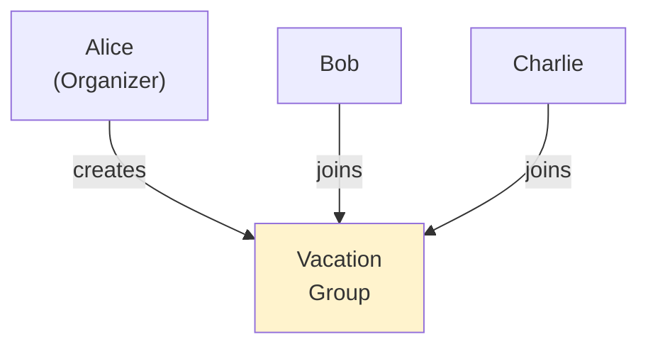
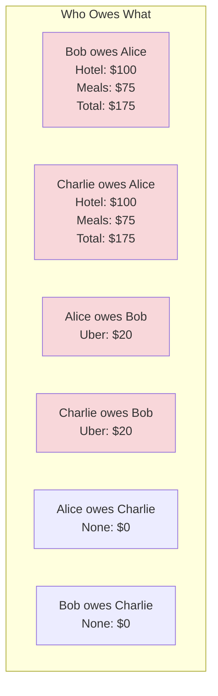
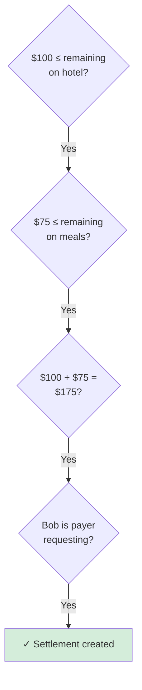
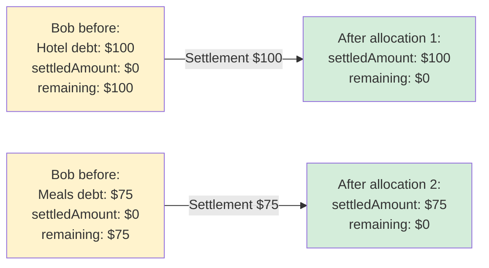
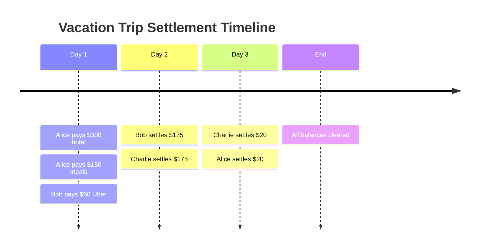
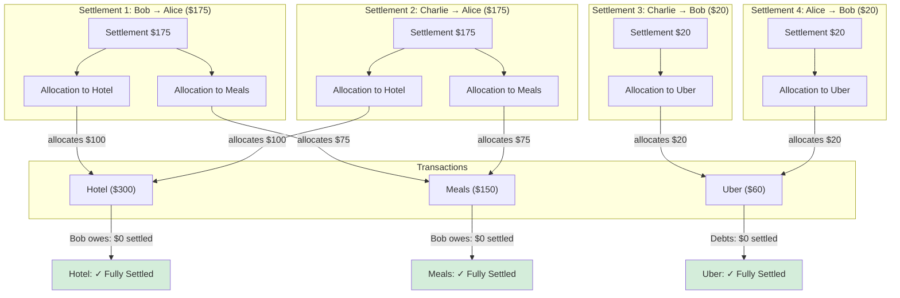

# Transactions & Settlements: Practical Example

## Vacation Group Scenario

A group of 3 friends planning a weekend trip.



## Transactions Flow

### Alice pays for hotel

```
Alice: "I paid $300 for the hotel, everyone stayed there"
- Transaction 1: $300 total
  - Alice paid
  - Bob owes $100
  - Charlie owes $100
  - Alice gets back $100
```

**System creates:**
- Transaction entity (id: txn-1, total: $300, paidBy: Alice)
- TransactionMember: Bob → $100
- TransactionMember: Charlie → $100
- TransactionMember: Alice → $100

### Alice pays for meals

```
Alice: "I bought group meals for $150"
- Transaction 2: $150 total
  - Alice paid
  - Bob owes $75
  - Charlie owes $75
```

**System creates:**
- Transaction entity (id: txn-2, total: $150, paidBy: Alice)
- TransactionMember: Bob → $75
- TransactionMember: Charlie → $75

### Bob pays for transportation

```
Bob: "I paid for the Uber, split 3 ways"
- Transaction 3: $60 total
  - Bob paid
  - Alice owes $20
  - Charlie owes $20
```

**System creates:**
- Transaction entity (id: txn-3, total: $60, paidBy: Bob)
- TransactionMember: Alice → $20
- TransactionMember: Charlie → $20

## Current Debts



## Group Debts Overview

```
Query: GET /api/transactions/group/{groupId}/debts

Alice:
- totalOwed: $20 (owes Bob for Uber)
- settledAmount: $0
- remainingOwed: $20

Bob:
- totalOwed: $175 (owes Alice)
- settledAmount: $0
- remainingOwed: $175

Charlie:
- totalOwed: $195 (owes Alice $175 + Bob $20)
- settledAmount: $0
- remainingOwed: $195
```

## Settlement 1: Bob Pays Alice

```
Bob creates: "Settling for the hotel meal split"
Settlement:
  - Amount: $175
  - Payer: Bob
  - Payee: Alice
  - Allocations:
    1. Hotel (txn-1): $100 (clears Bob's hotel debt)
    2. Meals (txn-2): $75 (clears Bob's meal debt)
```

**System validates:**


**Impact on balances:**



## Settlement 2: Charlie Pays Alice

```
Charlie creates: "Paying for my hotel and meal split"
Settlement:
  - Amount: $175
  - Payer: Charlie
  - Payee: Alice
  - Allocations:
    1. Hotel (txn-1): $100
    2. Meals (txn-2): $75
```

**Result:**
- Charlie's debt to Alice: CLEARED ($175 paid)
- Alice's status:
  - Paid by Bob: $175 ✓
  - Paid by Charlie: $175 ✓
  - Net: $0

## Settlement 3: Charlie Pays Bob

```
Charlie creates: "Paying for the Uber ride"
Settlement:
  - Amount: $20
  - Payer: Charlie
  - Payee: Bob
  - Allocations:
    1. Uber (txn-3): $20
```

## Settlement 4: Alice Pays Bob

```
Alice creates: "Paying for my share of the Uber"
Settlement:
  - Amount: $20
  - Payer: Alice
  - Payee: Bob
  - Allocations:
    1. Uber (txn-3): $20
```

## Final Group Debts

```
Query: GET /api/transactions/group/{groupId}/debts

Alice:
- totalOwed: $20
- settledAmount: $20 ✓
- remainingOwed: $0

Bob:
- totalOwed: $175
- settledAmount: $175 ✓
- remainingOwed: $0

Charlie:
- totalOwed: $195
- settledAmount: $195 ✓
- remainingOwed: $0

✓ ALL SETTLED
```

## Settlement Timeline



## Allocation Linkage Visualization



## API Calls Summary

```bash
# 1. Create hotel transaction
POST /api/transactions
{
  "groupId": "group-1",
  "totalAmount": 300,
  "currency": "USD",
  "category": "Lodging",
  "description": "Hotel",
  "members": [
    {"userId": "bob-id", "amountOwed": 100},
    {"userId": "charlie-id", "amountOwed": 100},
    {"userId": "alice-id", "amountOwed": 100}
  ]
}

# 2-3. Create meals and Uber transactions
# (similar structure)

# 4. Create Bob's settlement
POST /api/settlements
{
  "groupId": "group-1",
  "payerUserId": "bob-id",
  "payeeUserId": "alice-id",
  "amount": 175,
  "currency": "USD",
  "allocations": [
    {"transactionId": "txn-1", "debtorUserId": "bob-id", "allocatedAmount": 100},
    {"transactionId": "txn-2", "debtorUserId": "bob-id", "allocatedAmount": 75}
  ]
}

# 5-8. Create remaining settlements
# (similar structure)

# View final group debts
GET /api/transactions/group/group-1/debts
```
