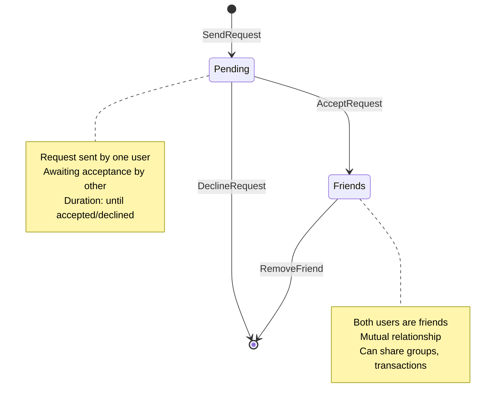

# Friends Architecture

## Friendship States



## Friendship Lifecycle

1. **Initial State**: No relationship
2. **Pending**: One user sends request to another
   - Request stored with `SenderId` and `Status = Pending`
   - Other user sees as incoming request
   - Sender can cancel by removing
   - Receiver can accept or decline

3. **Friends**: Both users accepted
   - `Status = Friends`
   - `UpdatedAt` timestamp set
   - Can collaborate on groups and transactions
   - Either user can remove friendship

4. **Final State**: Relationship removed
   - Friendship record deleted
   - Cannot be in Pending or Friends state

## Service Layer Architecture

```
FriendService
├── SendRequestAsync(senderId, dto)
│   ├── Validate email or userId provided (not both, not neither)
│   ├── If email: normalize and resolve to user ID
│   ├── Validate user exists
│   ├── Validate sender ≠ receiver
│   ├── Check no existing friendship
│   └── Create Friendship with Status = Pending
│
├── AcceptRequestAsync(currentUserId, requesterId)
│   ├── Query friendship by ordered IDs
│   ├── Verify exists and is Pending
│   └── Update Status to Friends + UpdatedAt
│
├── RemoveFriendAsync(currentUserId, otherUserId)
│   ├── Query friendship by ordered IDs
│   ├── Verify exists
│   └── Delete friendship
│
├── GetPendingRequestsAsync(userId)
│   ├── Query pending friendships where user is receiver
│   ├── Load requester user details
│   ├── Resolve profile picture URLs
│   └── Map to PendingFriendRequestDto
│
└── GetFriendsAsync(userId)
    ├── Query friends where user is either side
    ├── Extract opposite user IDs
    ├── Load friend user details
    ├── Resolve profile picture URLs
    └── Map to FriendResponseDto
```

## Database Schema

### Friendships Table
```
UserIdA         (GUID, PK1) - Smaller user ID
UserIdB         (GUID, PK2) - Larger user ID
SenderId        (GUID)      - Who initiated request
Status          (int)       - 0=Pending, 1=Friends, 2=Blocked
CreatedAt       (DateTime)  - Request send time
UpdatedAt       (DateTime?) - Status change time
```

**Composite Primary Key**: (UserIdA, UserIdB)
- Ensures single record per user pair
- Bidirectional relationship with one record
- Order matters: smaller ID first

**Index on SenderId**: Speeds up "who sent me requests" queries

## Key Design Decisions

### 1. Bidirectional Storage
- Store once with ordered IDs (not A→B and B→A separately)
- Reduces database size by 50%
- Consistent lookup pattern

### 2. Email Normalization
- Trim and normalize emails before lookup
- Case-insensitive user matching
- Prevents duplicates from email variations

### 3. Pending Status
- Request explicitly waiting for acceptance
- Both users aware of request
- Sender recorded for notification purposes

### 4. Soft Deletions Not Used
- Friendships are hard-deleted
- No archive needed for compliance
- Clean separation of concerns

### 5. Profile Pictures Optional
- Included when available, null otherwise
- Resolved through IFileStorageService
- Lazy-loaded only when needed

## Dependencies

- **AppDbContext**: EF Core database context
- **ILookupNormalizer**: Email normalization (ASP.NET Identity)
- **IFileStorageService**: Profile picture URL resolution

## Error Handling

| Error | Cause | HTTP Status |
|-------|-------|------------|
| ValidationException | Both/neither email and userId, self-add, duplicate request | 400 |
| NotFoundException | User or friendship not found | 404 |
| - | Invalid email format | 400 |
| - | Sender ≠ receiver required | 400 |

## Performance Considerations

### Query Optimization
- Friendship queries use composite primary key: O(1) lookup
- Pending/Friends requests use indexed SenderId: O(log n)
- User bulk load via dictionary: Single DB roundtrip

### Scalability
- Bidirectional storage = 50% less data
- Composite keys = no sequential scans
- Profile pictures cached by storage service
- No N+1 queries in list operations
