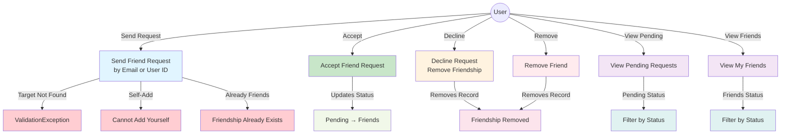

# Friends Management Use Case Diagram

## Description

This diagram shows all user interactions with the friend management system:

### Core Operations
- **Send Friend Request**: Users can send requests via email or user ID
  - Validates email format and user existence
  - Prevents self-adds and duplicate requests
  
- **Accept Friend Request**: Accept a pending friend request
  - Updates friendship status from Pending to Friends
  - Records the acceptance timestamp

- **Decline/Remove Friend**: Remove a friendship or pending request
  - Removes the friendship record entirely
  - Available for both pending and accepted friendships

### Retrieval Operations
- **View Pending Requests**: Retrieve all pending friend requests received by the user
  - Includes requester name, email, and profile picture
  - Sorted by request creation time

- **View My Friends**: Retrieve all accepted friendships
  - Lists friend information with profile pictures
  - Only includes Friends status relationships

### Validation Rules
- Cannot add yourself as a friend
- Cannot duplicate friend requests
- Target user must exist (by email or user ID)
- Email must be valid format
- Friendship relationships are bidirectional (stored with ordered IDs)
