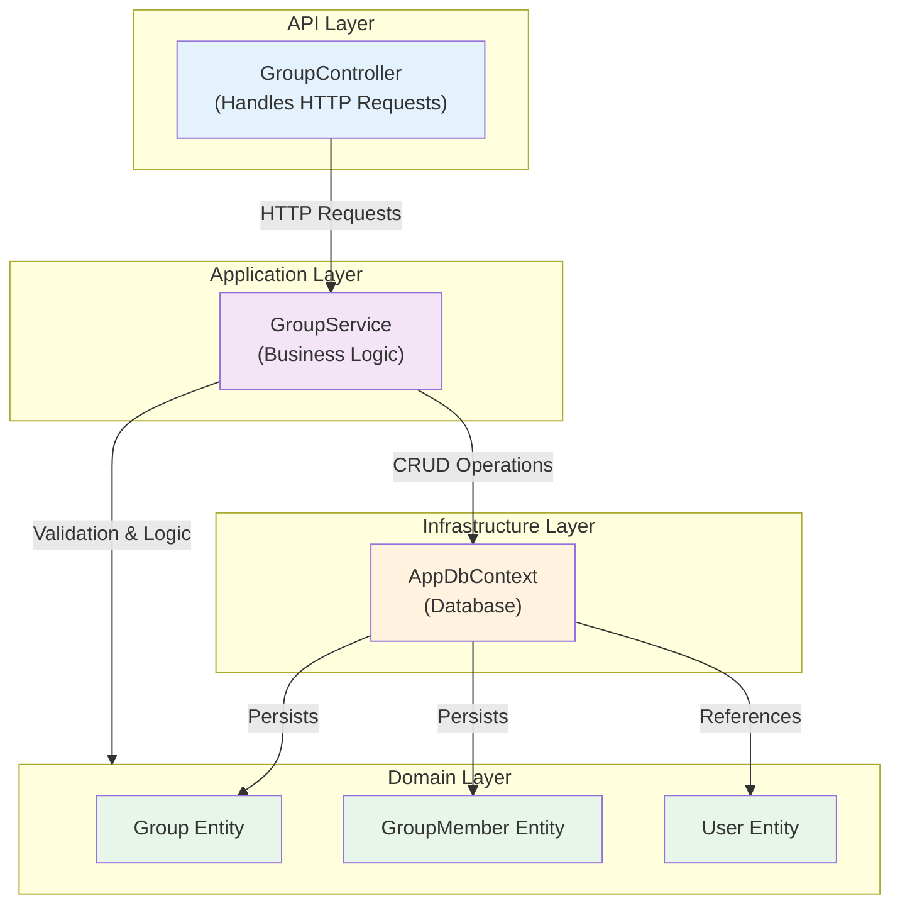

# Group Services Architecture

## Architecture Overview

The group management system follows a clean layered architecture:

### API Layer
- **GroupController**: Handles HTTP endpoints for all group operations
  - Authentication via JWT claims
  - Request validation and routing
  - HTTP response handling

### Application Layer
- **GroupService**: Contains all business logic
  - Group creation with validation
  - Member management (join, exit)
  - Authorization checks (creator-only operations)
  - Owner role transfer on exit
  - Service consolidation (moved from Infrastructure)

### Domain Layer
Defines core entities:
- **Group**: Main group aggregate root
  - Id, Name, CreatedById, InviteToken
- **GroupMember**: User membership in a group
  - GroupId, UserId, JoinedAt
- **User**: Referenced for membership

### Infrastructure Layer
- **AppDbContext**: Entity Framework Core database context
  - Persistence layer
  - CRUD operations for groups and members
  - Direct data access for GroupService

## Key Design Decisions

1. **Service Consolidation**: GroupService moved to Application layer to keep business logic in a single, testable location
2. **Direct DB Access**: GroupService accesses AppDbContext directly for data persistence
3. **Validation**: Name validation happens in service before persistence
4. **Auto-generated Tokens**: InviteToken generated by database on group creation
5. **Owner Transfer**: Automatic role transfer to oldest member when creator exits

## Data Flow

1. **Create Group**: Controller → Service (validate) → DB (create Group + add Member)
2. **Join Group**: Controller → Service (validate token & membership) → DB (add Member)
3. **Exit Group**: Controller → Service (validate, check role, manage deletion) → DB (remove Member)
4. **Get Groups**: Controller → Service → DB (query with members) → return DTOs
5. **Update Group**: Controller → Service (validate creator) → DB (update Group)
6. **Delete Group**: Controller → Service (validate creator) → DB (remove all Members + Group)
