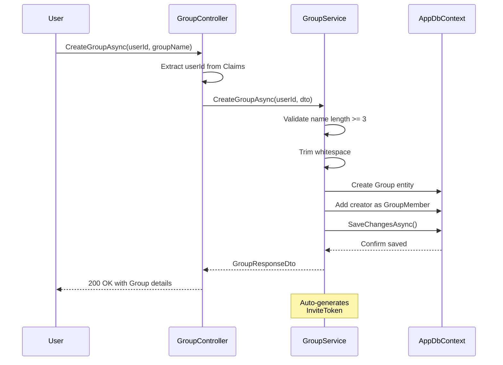
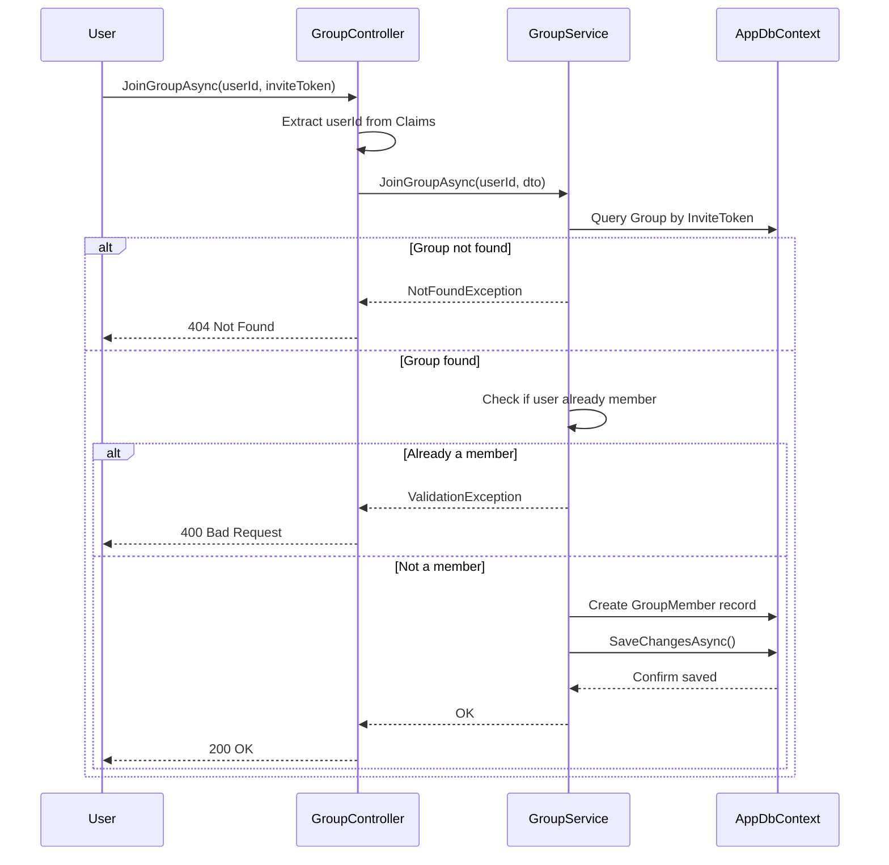
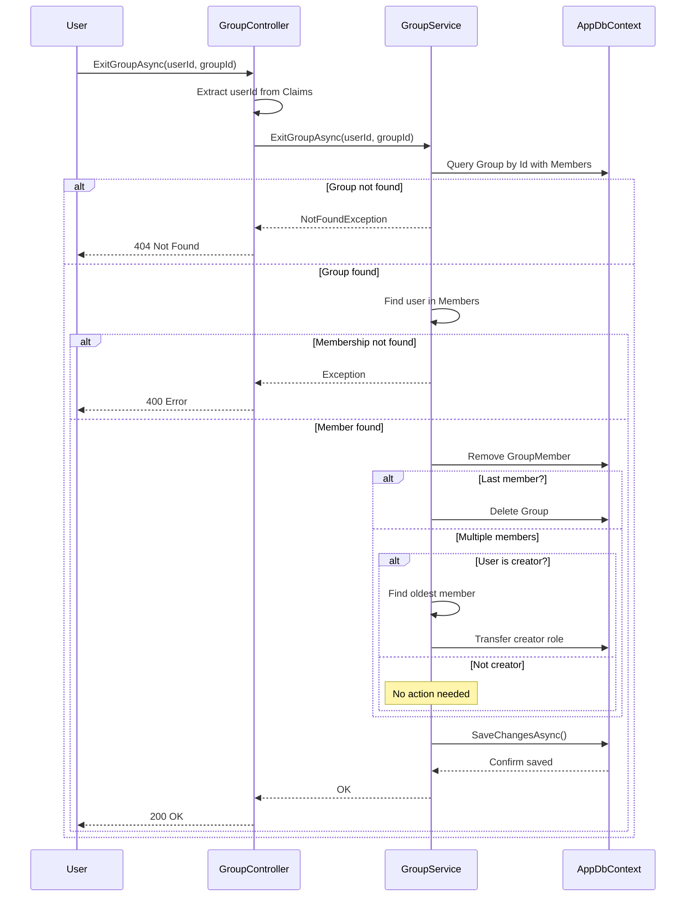

# Group Services Sequence Diagrams

## Create Group Flow

### Process Steps
1. User sends HTTP request with group name
2. Controller extracts userId from JWT claims
3. Service validates group name (minimum 3 characters)
4. Service creates Group entity with creator as first member
5. Group is persisted to database
6. InviteToken is auto-generated by the database
7. Response returned with group details

---

## Join Group Flow

### Process Steps
1. User sends HTTP request with invite token
2. Controller extracts userId from JWT claims
3. Service queries database for group by invite token
4. If group not found: return 404 NotFoundException
5. If user already a member: return 400 ValidationException
6. Otherwise: create GroupMember record linking user to group
7. Persist to database and return success

---

## Exit Group Flow

### Process Steps
1. User sends HTTP request with group ID
2. Controller extracts userId from JWT claims
3. Service queries group with all members
4. If group not found: return 404 NotFoundException
5. If user not a member: return 400 Exception
6. Remove user from GroupMembers
7. **Special Logic:**
   - If user was last member: delete entire group
   - If user was creator but not last member: transfer owner role to oldest (by JoinedAt) member
   - If user was regular member: no additional action
8. Persist changes and return success
