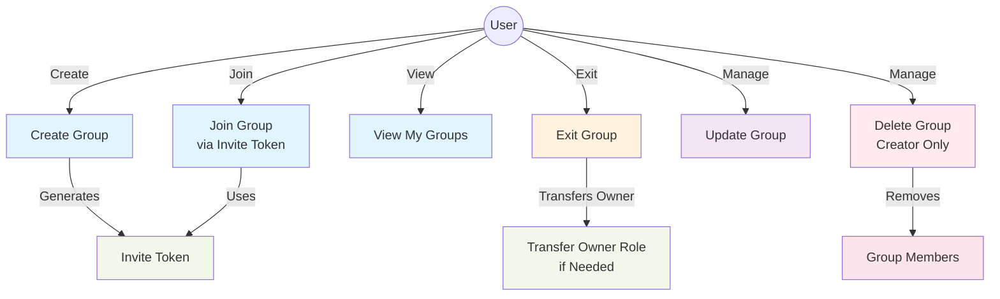

# Group Services Use Case Diagram

## Description

This diagram shows all user interactions with the group management system:

- **Create Group**: Users can create new groups (auto-generates invite token)
- **Join Group**: Users can join existing groups using an invite token
- **View My Groups**: Users can retrieve all groups they're members of
- **Exit Group**: Users can leave a group (triggers owner transfer if needed)
- **Update Group**: Group creators can update group details
- **Delete Group**: Only group creators can delete groups (removes all members)

The diagram also illustrates key relationships:
- Invite tokens are generated on group creation and used for joining
- Group deletion removes all associated members
- Exiting as creator triggers automatic owner role transfer to the oldest member
