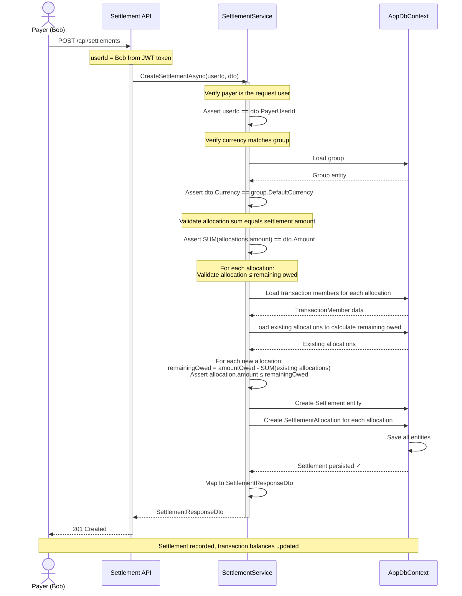
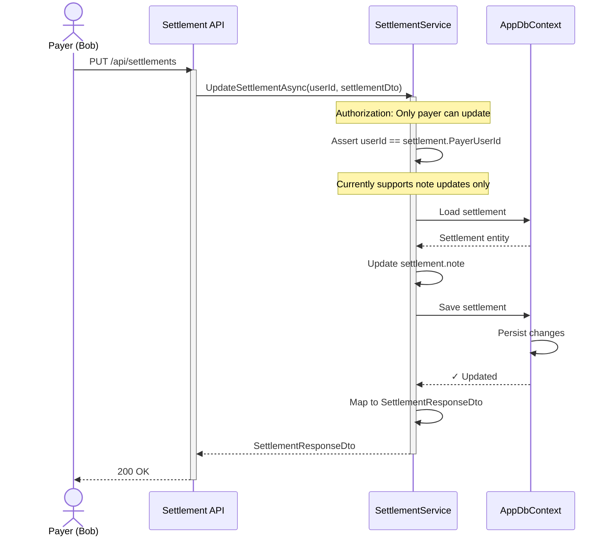
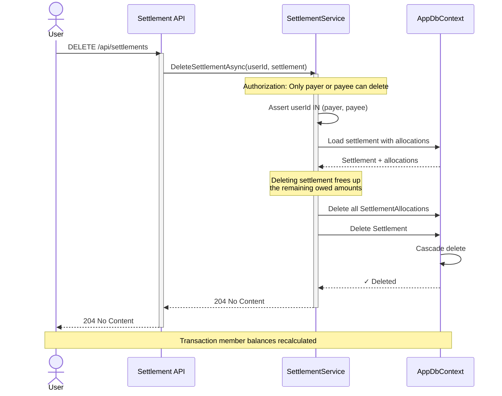
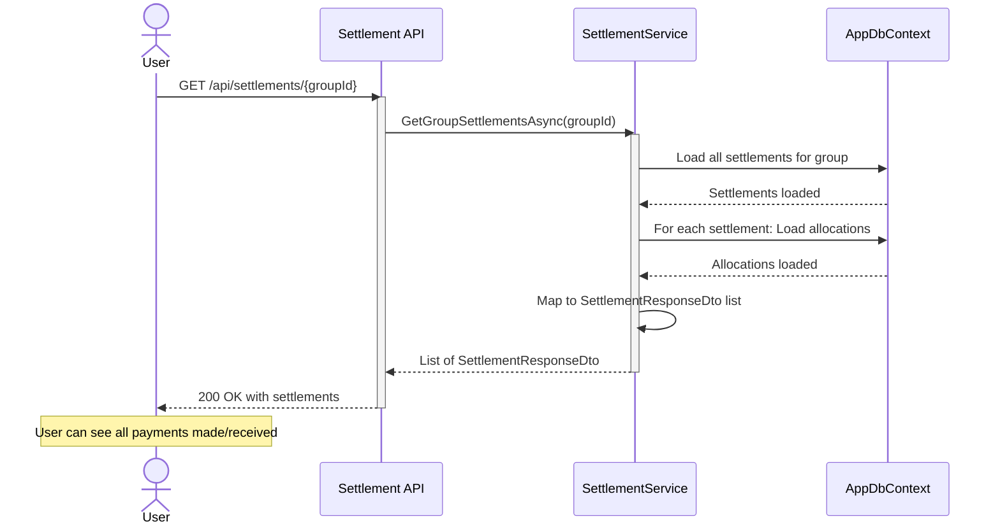
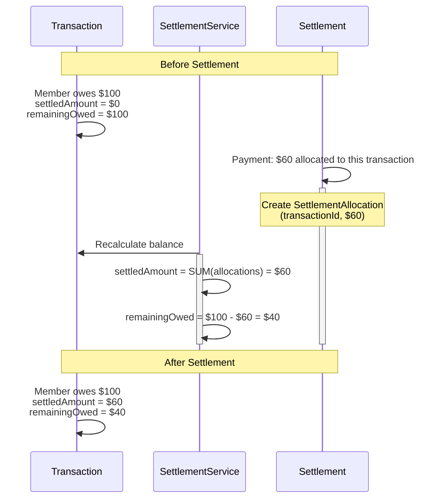

# Settlement Sequence Diagram

## Creating a Settlement

Shows the flow when a payer creates a settlement to pay the payee.

## Updating a Settlement

Shows that only the payer can update settlement notes.

## Deleting a Settlement

Shows authorization and cascade effects on transaction balances.

## Getting Group Settlements

Shows all settlement records for a group with their allocations.

## Settlement Impact on Transaction Balances

Shows how a settlement allocation affects the transaction's balance calculations.

