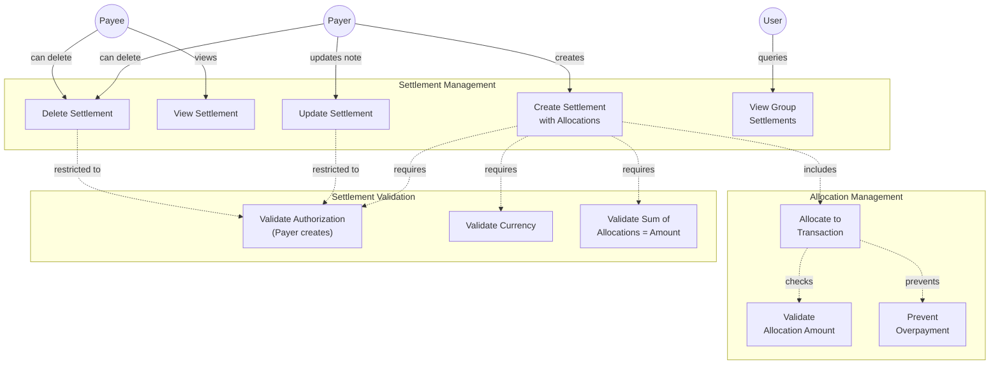
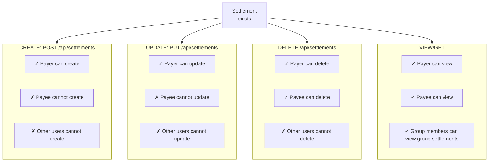
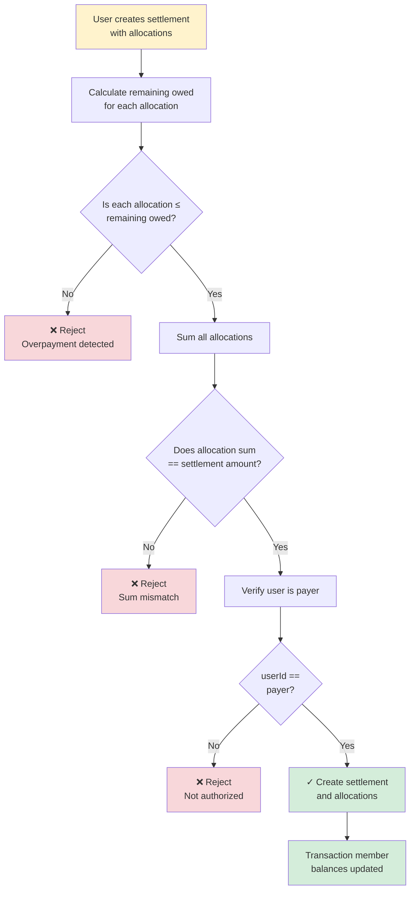
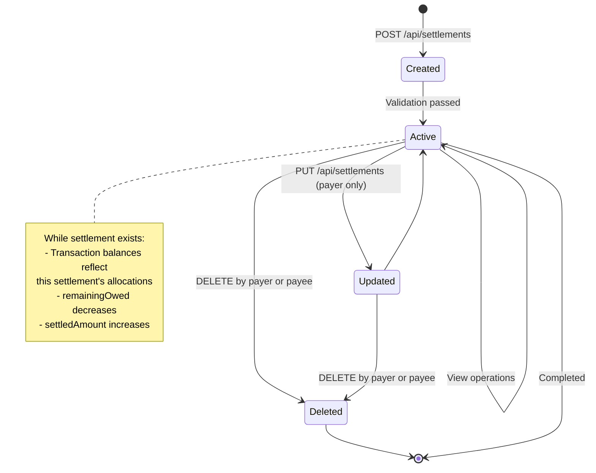
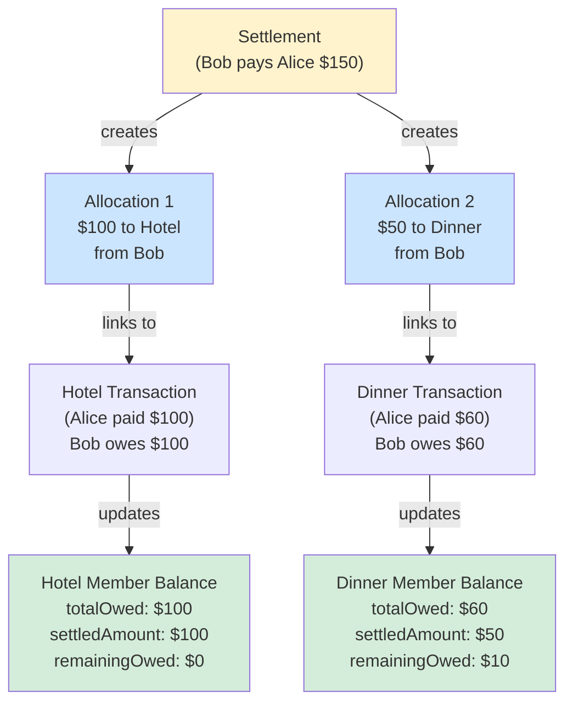
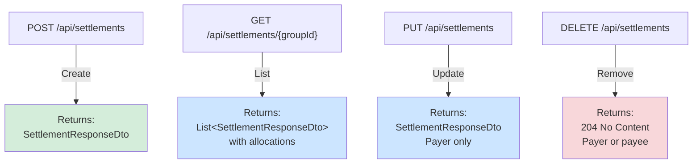
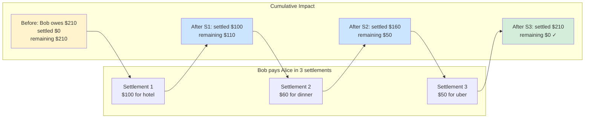

# Settlement Use Cases

## Settlement Use Case Diagram

## Settlement Authorization Matrix

## Settlement Allocation Validation Flow

## Settlement State Diagram

## Settlement Allocation Linkage

## Settlement API Endpoints

## Multi-Settlement Payment Scenario

