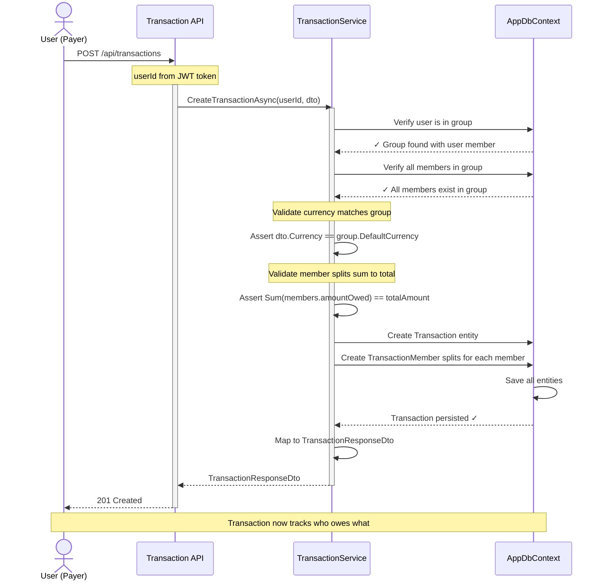
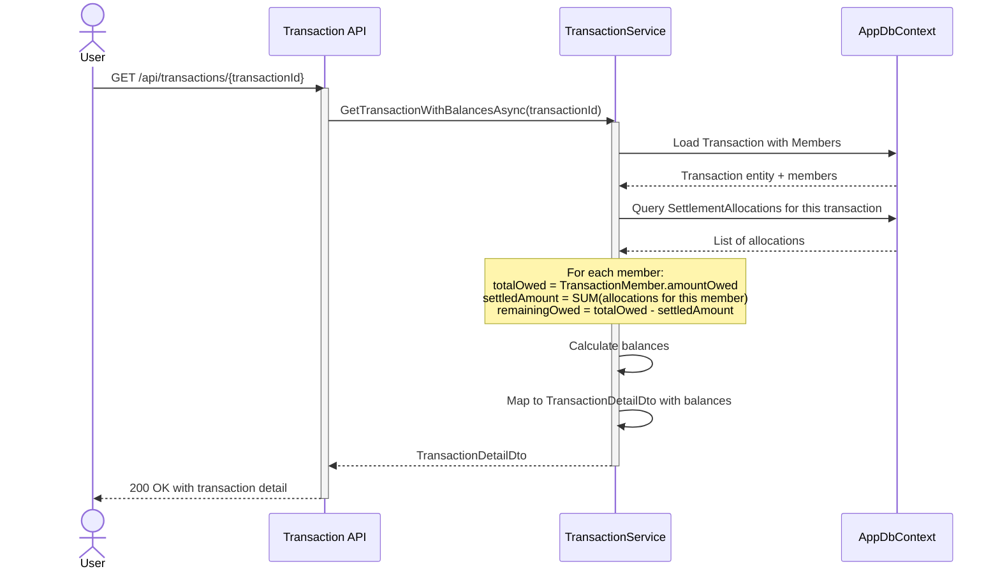
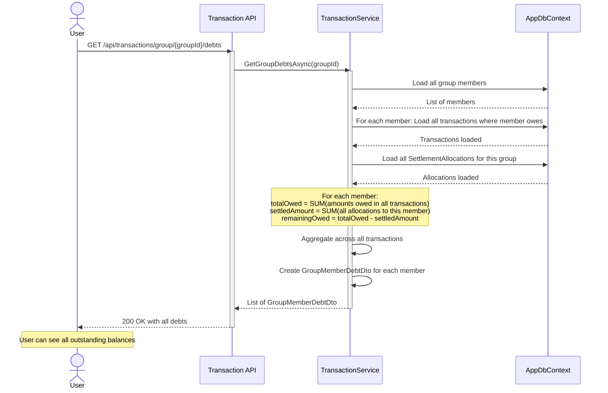

# Transaction Sequence Diagram

## Creating a Transaction

Shows the flow when a user creates an expense transaction with multiple members.

## Getting Transaction with Balances

Shows how settled amounts are calculated when retrieving transaction details.

## Getting Group Debts

Shows aggregation across all transactions to get group-wide debt overview.

