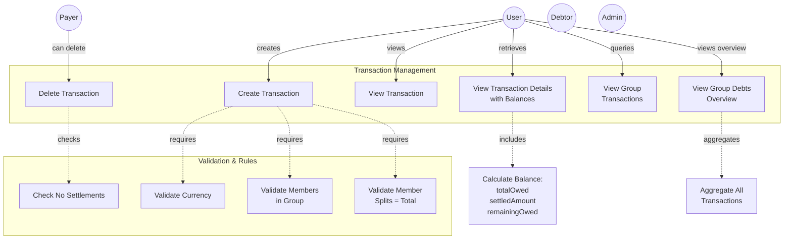
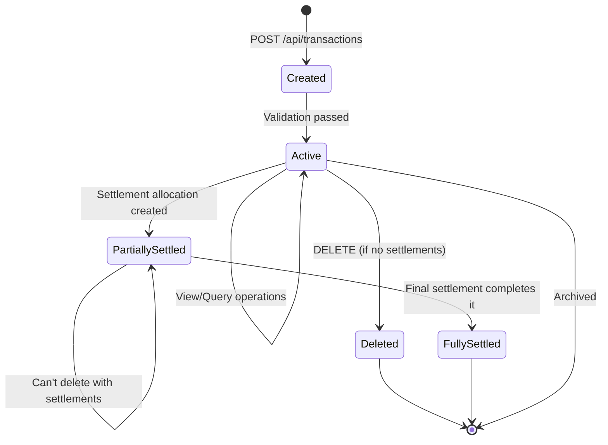
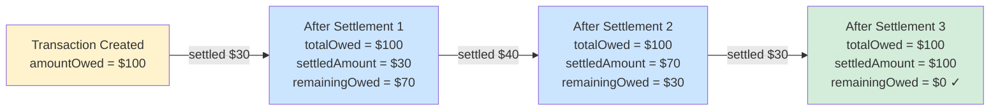
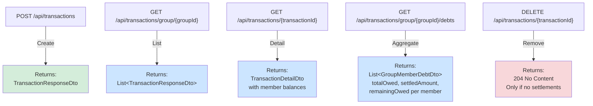

# Transaction Use Cases

## Transaction Use Case Diagram

```mermaid
graph TB
    User((User))
    Payer((Payer))
    Debtor((Debtor))
    Admin((Admin))
    
    subgraph Transaction["Transaction Management"]
        CreateTrans["Create Transaction"]
        ViewTrans["View Transaction"]
        ViewDetail["View Transaction Details<br/>with Balances"]
        DeleteTrans["Delete Transaction"]
        ViewGroupTrans["View Group<br/>Transactions"]
        ViewGroupDebts["View Group Debts<br/>Overview"]
    end
    
    subgraph Validation["Validation & Rules"]
        ValidCurrency["Validate Currency"]
        ValidMembers["Validate Members<br/>in Group"]
        ValidSplit["Validate Member<br/>Splits = Total"]
        CheckDelete["Check No Settlements"]
    end
    
    User -->|creates| CreateTrans
    User -->|views| ViewTrans
    User -->|retrieves| ViewDetail
    Payer -->|can delete| DeleteTrans
    User -->|queries| ViewGroupTrans
    User -->|views overview| ViewGroupDebts
    
    CreateTrans -.->|requires| ValidCurrency
    CreateTrans -.->|requires| ValidMembers
    CreateTrans -.->|requires| ValidSplit
    DeleteTrans -.->|checks| CheckDelete
    
    ViewDetail -.->|includes| CalculateBalance["Calculate Balance:<br/>totalOwed<br/>settledAmount<br/>remainingOwed"]
    
    ViewGroupDebts -.->|aggregates| AggregateDebts["Aggregate All<br/>Transactions"]
```

## Transaction State Machine

```mermaid
stateDiagram-v2
    [*] --> Created: POST /api/transactions
    
    Created --> Active: Validation passed
    
    Active --> Active: View/Query operations
    
    Active --> PartiallySettled: Settlement allocation created
    PartiallySettled --> PartiallySettled: Another settlement allocated
    
    PartiallySettled --> FullySettled: Final settlement completes it
    
    Active --> Deleted: DELETE (if no settlements)
    PartiallySettled --> PartiallySettled: Can't delete with settlements
    
    Deleted --> [*]
    FullySettled --> [*]
    Active --> [*]: Archived
```

## Transaction Member Balance Lifecycle

```mermaid
graph LR
    A["Transaction Created<br/>amountOwed = $100"] -->|settled $30| B["After Settlement 1<br/>totalOwed = $100<br/>settledAmount = $30<br/>remainingOwed = $70"]
    
    B -->|settled $40| C["After Settlement 2<br/>totalOwed = $100<br/>settledAmount = $70<br/>remainingOwed = $30"]
    
    C -->|settled $30| D["After Settlement 3<br/>totalOwed = $100<br/>settledAmount = $100<br/>remainingOwed = $0 ✓"]
    
    style A fill:#fff3cd
    style B fill:#cce5ff
    style C fill:#cce5ff
    style D fill:#d4edda
```

## Transaction API Endpoints

```mermaid
graph TB
    POST["POST /api/transactions"] -->|Create| CreateTrans["Returns:<br/>TransactionResponseDto"]
    
    GET1["GET /api/transactions/group/{groupId}"] -->|List| ListTrans["Returns:<br/>List&lt;TransactionResponseDto&gt;"]
    
    GET2["GET /api/transactions/{transactionId}"] -->|Detail| DetailTrans["Returns:<br/>TransactionDetailDto<br/>with member balances"]
    
    GET3["GET /api/transactions/group/{groupId}/debts"] -->|Aggregate| GroupDebts["Returns:<br/>List&lt;GroupMemberDebtDto&gt;<br/>totalOwed, settledAmount,<br/>remainingOwed per member"]
    
    DELETE["DELETE /api/transactions/{transactionId}"] -->|Remove| DelTrans["Returns:<br/>204 No Content<br/>Only if no settlements"]
    
    style CreateTrans fill:#d4edda
    style ListTrans fill:#cce5ff
    style DetailTrans fill:#cce5ff
    style GroupDebts fill:#cce5ff
    style DelTrans fill:#f8d7da
```
