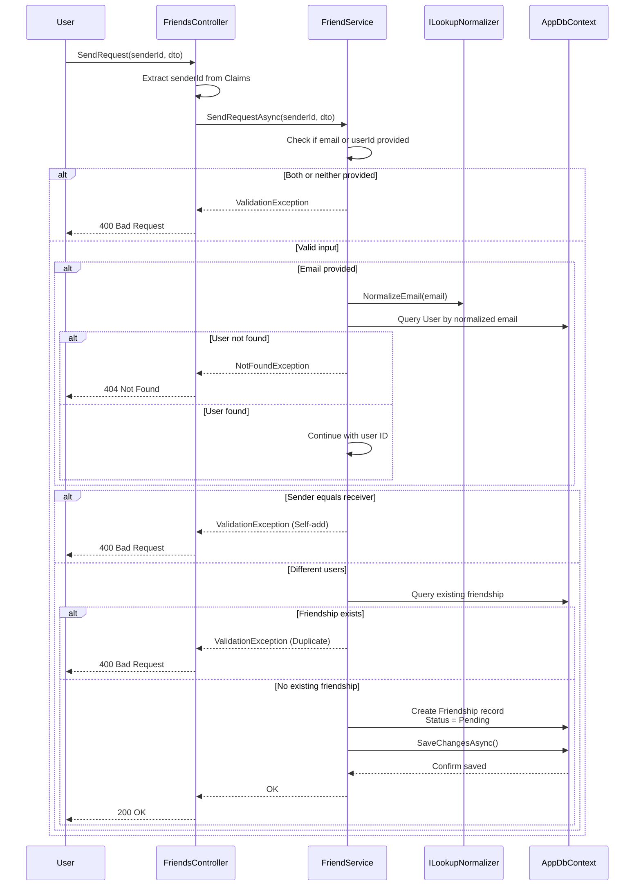
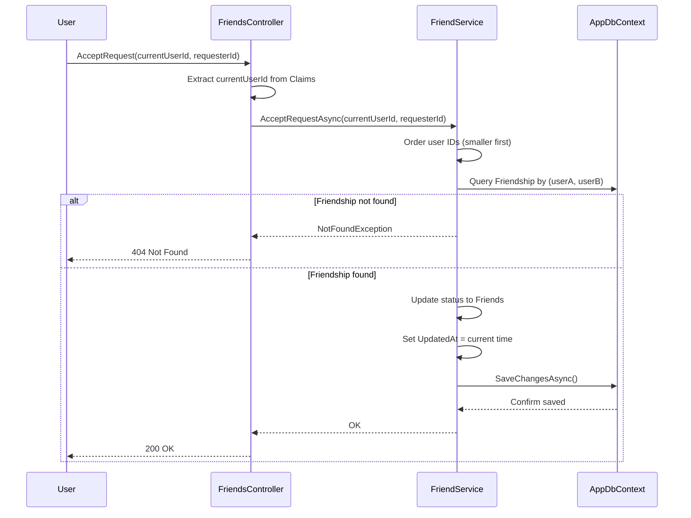
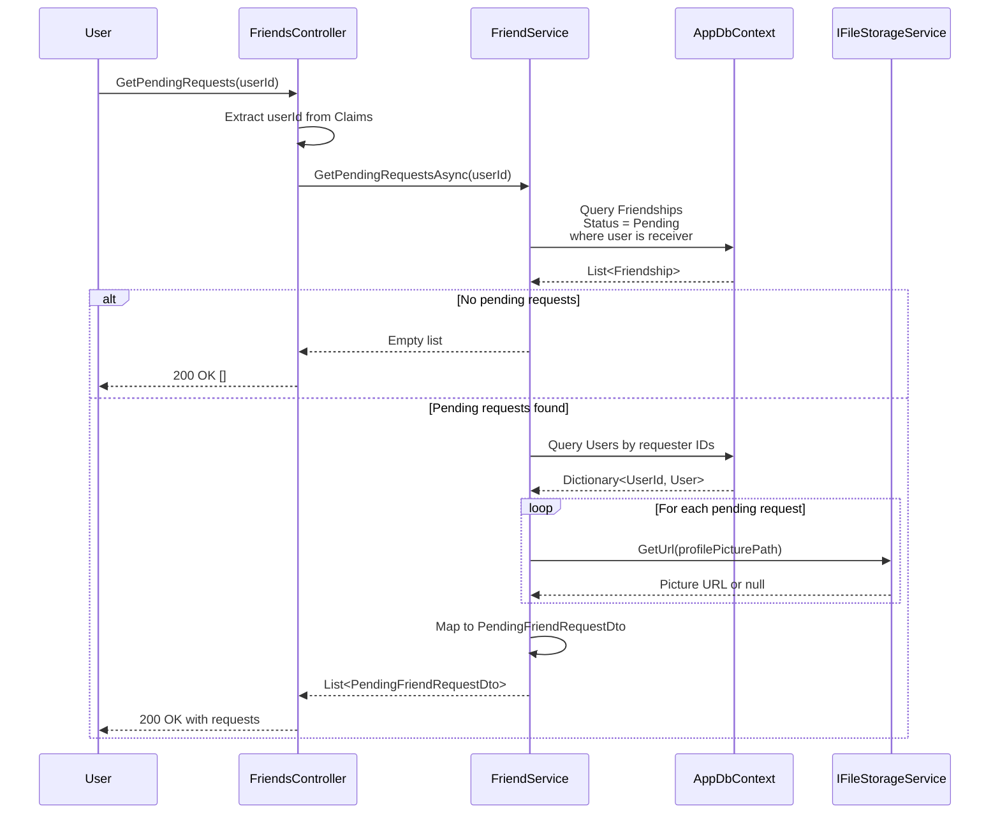
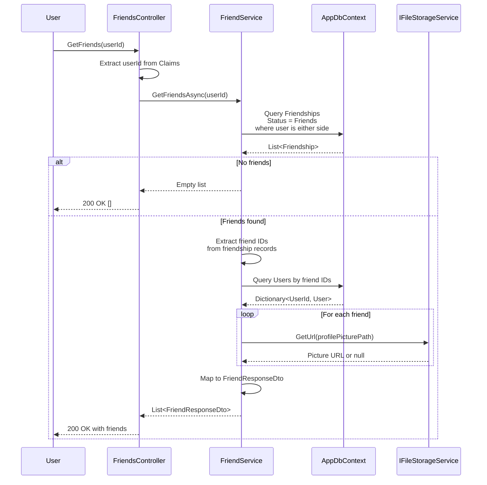
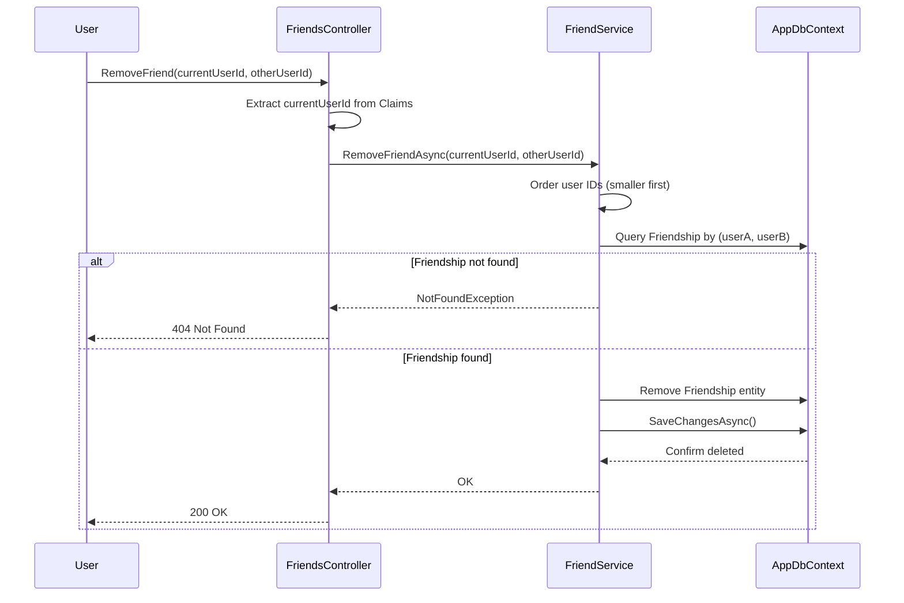

# Friends Management Sequence Diagrams

## Send Friend Request Flow

### Process Steps
1. User sends request with target email or user ID
2. Controller extracts sender userId from JWT claims
3. Service validates exactly one identifier provided
4. If email: normalize and query database for user
5. Check if sender and receiver are different users
6. Check for existing friendship (prevent duplicates)
7. Create Friendship entity with status = Pending
8. Persist and return success

---

## Accept Friend Request Flow

### Process Steps
1. User sends request with requester ID
2. Controller extracts current user ID from JWT
3. Service orders user IDs consistently (smaller first)
4. Service queries database for friendship with both IDs
5. If not found: return 404 NotFoundException
6. If found: update status from Pending to Friends
7. Record update timestamp
8. Persist and return success

---

## Get Pending Requests Flow

### Process Steps
1. User requests pending friend requests
2. Controller extracts user ID from JWT claims
3. Service queries database for pending friendships where user is receiver
4. Service retrieves requester user details
5. Service resolves profile picture URLs
6. Service maps to DTOs with sender info
7. Return list sorted by creation time

---

## Get Friends List Flow

### Process Steps
1. User requests friends list
2. Controller extracts user ID from JWT
3. Service queries database for accepted friendships
4. Friendship entities store both users (userA, userB)
5. Service identifies friend IDs (the "other" user in each pair)
6. Service retrieves friend details from database
7. Service resolves profile picture URLs from storage service
8. Service maps to DTOs with friend information
9. Return complete friends list

---

## Remove Friend Flow

### Process Steps
1. User sends remove request with friend ID
2. Controller extracts current user ID from JWT
3. Service orders user IDs consistently
4. Service queries database for friendship
5. If not found: return 404 NotFoundException
6. If found: delete the friendship record
7. Persist deletion and return success

---

## Data Model: Friendship Entity

The `Friendship` entity stores bidirectional relationships:

- **UserIdA**: First user ID (smaller GUID value)
- **UserIdB**: Second user ID (larger GUID value)
- **SenderId**: Who initiated the request
- **Status**: Pending, Friends, or Blocked
- **CreatedAt**: When request was sent
- **UpdatedAt**: When status changed (null until accepted)

### Why Order IDs?
By consistently storing the smaller ID as UserIdA, we ensure:
- Single friendship record per pair (not duplicate records for A→B and B→A)
- Efficient lookups by always querying with ordered IDs
- Bidirectional relationships with minimal storage
